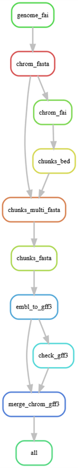
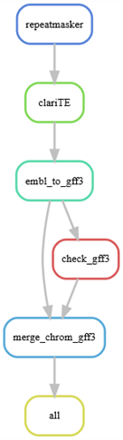
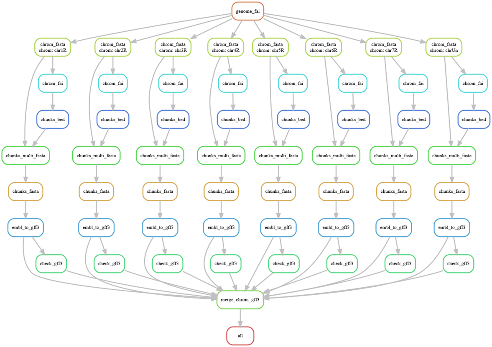

# TE annotation

Transposable elements annotation of *Secale cereale* genome, in collaboration with A. BOUGUENNEC (UMR GDEC, INRAE).  
from /home/login/projects/soutien_bioinfo/BOUGUENNEC/ on HPC2 cluster (Mésocentre, Université Clermont-Auvergne)

## Material & Methods  

Reference genome: [Rabanus-Wallace et al, 2021](https://doi.org/10.1038/s41588-021-00807-0)  

### CLARI-TE_ sh

CLARI-TE_sh is a shell pipeline for TE annotation working on HPC cluster and using RepeatMasker and ClariTE tools.  
Calculs are parallelized in this pipeline and executed on a HPC cluster with SLURM that will schedules job-array submissions.  
This pipeline is launched with a master script, that launches itself two sub scripts that are linked by dependencies.  
During the workflow, some bash tests and logs permits to control if all expected files are produced, with the ad hoc format for gff3.  

### CLARI-TE_ smk

A Snakemake pipeline for TE annotation working on HPC cluster (slurm).  

This Snakmake workflow uses a Singularity image named 'singularity_RMclariTE.sif' containing all tools and dependencies needed. Snakemake rules will be executed within this image, built with root permissions (on my own computer) tanks to the definition file 'singularity_RMclariTE.def' and the following commands:


You will need Singularity to buil an image conttaining the necessary tools and their dependencies, and then specify the option "--use-singularity path/singularity.sif" in the snakemake command.  
```console
## to see the configuration file Singularity.conf with --dry-run option:
sudo singularity config global --dry-run --set "mount hostfs" yes
## to turn on that singularity will probe for all mounted file systems that are mounted on the host, and bind those into the container at runtime
sudo singularity config global --set "mount hostfs" yes
## to check that it is effective
sudo singularity config global --get "mount hostfs"

## to build the image with sudo permissions
sudo singularity build singularity_RMclariTE.sif singularity_RMclariTE.def

## to run the image as a user in an interactive way, and thus having access to its environment and tools
singularity shell singularity_RMclariTE.sif

## to execute a command within the image as a user in an non interactive way
singularity exec singularity_RMclariTE.sif RepeatMasker --help
```


To run this snakemake pipeline, it requires that Singularity is installed in order to execute the '.sif' file, and loading the following modules:  
```console
module load gcc/8.1.0 python/3.7.1 snakemake/7.15.1  
```

Then, fill in the "smk_config.yaml" file with your own genome informations, and the library that RepeatMasker will use if you desire to use another one.  
Eventually custom the cluster parameters in "cluster_profile/config.yaml" file according to the HPC cluster used.  

At first, it is recommended to make a dry-run (code test without execution) of the analysis.  
This will check all the rules and the parameters in the smk_config.yaml file and print all the command lines which would have been executed.  
```console
snakemake -nrp --singularity-args '--bind /home/palasser/data' --profile cluster_profile/
```

To have a view of the workflow and its successive rules:  
```console
snakemake --rulegraph > rulegraph.dot
```

You can then convert the .dot in .png with [Graphviz](https://dreampuf.github.io/GraphvizOnline)  

Flowchart before checkpoint rule:  


Flowchart after checkpoint rule, i.e. chunks_fasta, obtained after the pipeline has finished:  


The pipeline comes with a conda environment and tools (crossmatch, CLARI-TE) that are contained in a singularity image named "singularity_RMclariTE.sif".  
This workflow is built to be parallelized on HPC cluster and paramaters of calculs are setup for each rule by a config.yaml file and ressources specified directly in snakefile.  
In the config.yaml file, "jobs" (-j option) will allow to have at most 320 subproccess run through the SLURM scheduler, and "latency-wait" will permit to deal with busy clusters.  
To visualize the diagram of the parallelized processes, you can run the following command:  
```console
snakemake --dag > dag.dot
```
Diagram (without RepeatMasker and ClariTE rules as checkpoint not passed yet):  


The diagram after checkpoint can be obtained when smk pipeline has finished, but is not really readable (too large due to hundreds of parallel sub jobs).  

To launch the smk pipeline with sinngularity:  
```console
# snakemake command using the singularity container and a HPC cluster profile in folder cluster_profile/config.yaml defining options and cluster parameters
snakemake --singularity-args '--bind /home/palasser/data' --profile cluster_profile/
```

## Results  


## Support  

pauline.lasserre-zuber@inrae.fr, frederic.choulet@inrae.fr  

## Roadmap  

Describe TE length proportion changes for 10 top TE-families compared to reference sub-genomes.  

## Authors and acknowledgment  

Pauline LASSERRE-ZUBER (INRAe), Frederic CHOULET (INRAe)  
