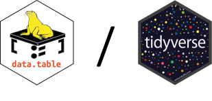

# data.table  

## Les ateliers codons  

Les ateliers codons sont des formations organisées en interne à l'UMR GDEC, pour les agents du GDEC souhaitant acquérir des compétences de programmation en langage R.
Prochainement, ces ateliers codons seront proposés par la formation permanente sous forme de e-learnig accessible à tous les agents INRAe du centre Auvergne Rhone-Alpes.

## L'atelier data.table  

Pour des tables de données de taille petite et moyenne (inférieure à 1 Go ou moins d’un million d’observations), il est recommandé d’utiliser le package dplyr.  
Pour des tables de données de grande taille (plus de 1 Go ou plus d’un million d’observations), il est recommandé d’utiliser le package data.table  
Un des atouts fondamentaux de data.table est sa syntaxe compacte qui lui vaut sa rapidité.
Les data.tables sont des data.frames particuliers: on peut donc leur appliquer toutes les méthodes valables pour les data.frames. 

**Sommaire** :  

**1**. IMPORT DE TABLES FORMAT LONG: readr vs fread  
**2.** CALCULS SUR LES COLONNES  
**3.** CREER UNE NOUVELLE COLONNE SELON CRITERES  
**4.** SELECTIONNER DES COLONNES  
**5.** JOINDRE DES TABLES  
**6.** EXPORT DE TABLE  
**7.** IMPORT DE TABLE FORMAT LARGE  
**8.** FORMATAGE DES DONNEES  

Les codes de cet atelier sont dans le répertoire /posts/07-data.table.  

## Le blog  

Le site web de supports de cours est construit avec l'outil quarto et hébergé par Netlify.  
Lien vers l'atelier [data.table](https://ateliers-codons.netlify.app/posts/07-data.table/)  

## Support  

pauline.lasserre-zuber@inrae.fr, jonathan.kitt@inrae.fr  

## Auteurs  

Pauline LASSERRE-ZUBER (INRAe), Jonathan KITT (INRAe)  
